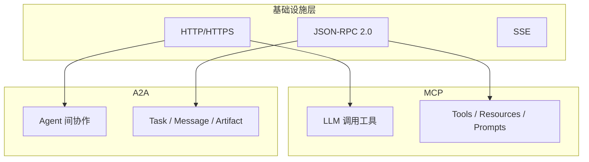
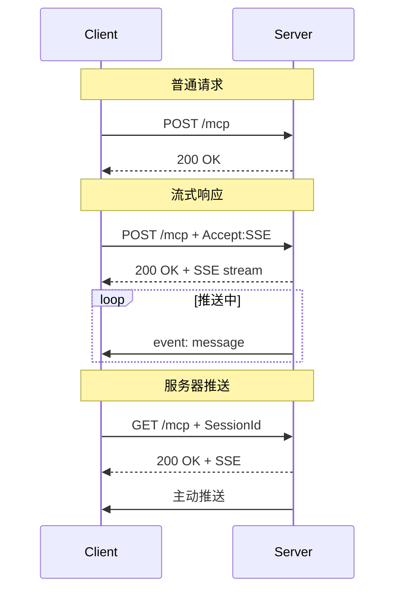
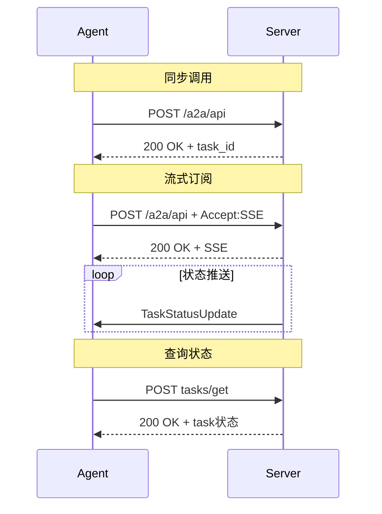
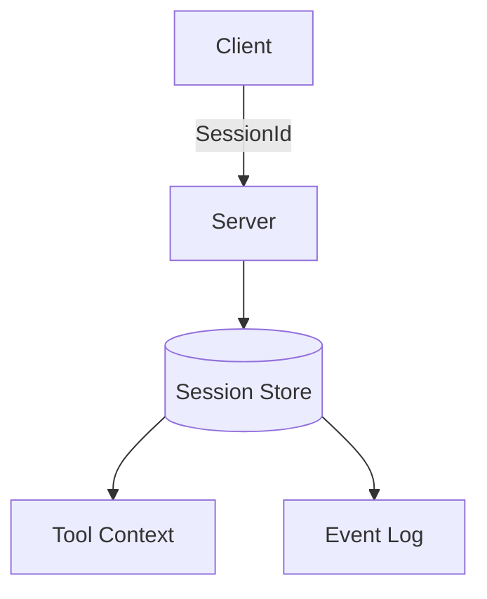
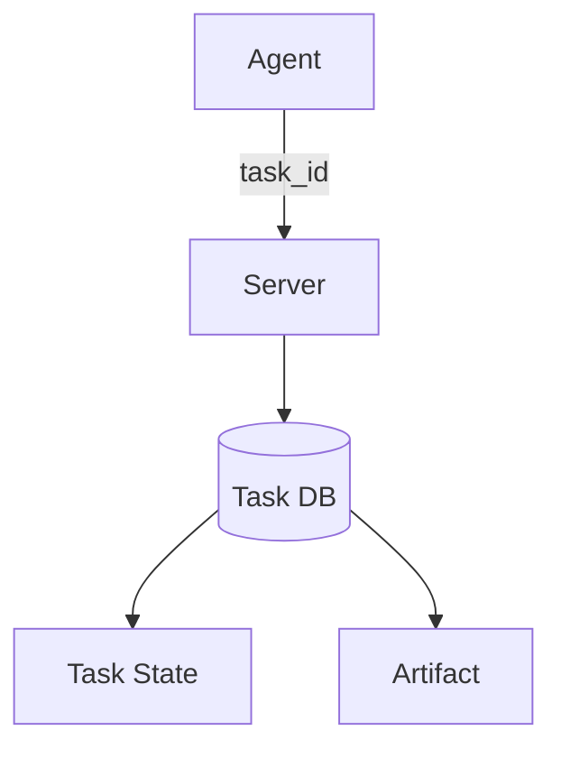
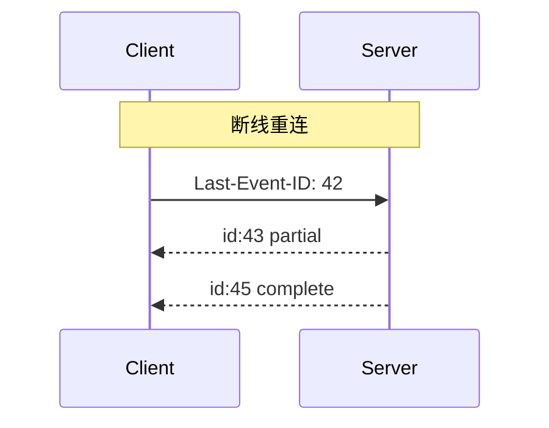
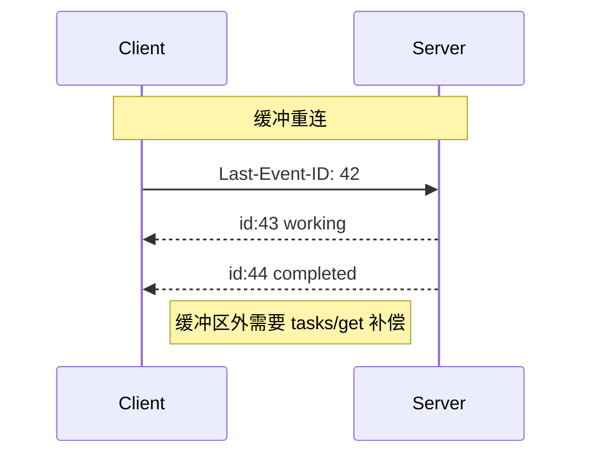
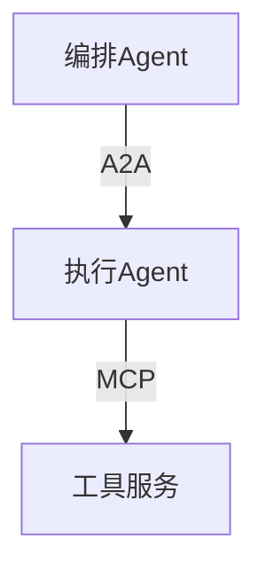

# MCP 与 A2A：两个时代的通信协议

---

很多人在对比 MCP 和 A2A 的时候，容易被表面的相似性迷惑。这两个协议都用了 HTTP + JSON-RPC + SSE，看起来确实差不多。但要真正理解它们的差异，不能只看协议规范上的 feature list，得往深了看——看它们各自要解决的核心问题是什么。

这篇文章就从**传输层的实现机制**出发，把这两个协议的技术差异讲透。

---

## 一、问题域的不同

先说本质区别：

- **MCP（Model Context Protocol）**：解决的是"LLM 如何调用外部能力"的问题。它是 LLM 与外部世界之间的桥梁。
- **A2A（Agent-to-Agent Protocol）**：解决的是"Agent 与 Agent 如何协作"的问题。它是多个 Agent 之间的通信协议。

这个根本差异，决定了后续所有的技术选择。

---

## 二、传输层机制详解

### 2.1 单端点复用

网上有种说法是"MCP 用双端点，A2A 用单端点"，这是错的。两个协议都是单端点复用，只是复用的方式不同。

**MCP 用 HTTP 方法 + Accept 头区分场景：**

MCP 的 `/mcp` 端点同时支持三种场景：普通请求响应、流式响应、服务器主动推送。用 HTTP 方法（GET/POST）加 Accept 头就能区分。

**A2A 用 JSON-RPC 方法名区分场景：**

A2A 所有请求都发到 `/a2a/api`，靠 JSON-RPC 的 `method` 字段（`message/send`、`message/stream`、`tasks/get`）决定行为。这种方式更符合 API Gateway 的常见模式。

**哪个更好？** 没有标准答案。MCP 的方式更贴合 HTTP 语义，A2A 的方式更容易在网关层统一处理。

### 2.2 会话管理

这是两个协议最核心的差异之一，直接影响部署复杂度。

**MCP 是有状态的：**

MCP 每次连接都有 `MCP-Session-Id`，服务器需要维护：
- 客户端能力声明（`initialize` 握手）
- 工具调用的中间结果
- 事件日志（用于断点续传）

这意味着部署时需要**会话亲和性**或**共享存储**。负载均衡器不能随意路由。

**A2A 是无状态的：**

A2A 不维护会话，所有状态存外部数据库。服务器可以任意扩缩容，负载均衡器不需要特殊配置。

### 2.3 断点续传

**MCP 的断点续传是精确的：**

每个事件都有序号，服务器维护完整事件日志。断线后从断点精确续传，不会重复，不会丢失。

**A2A 的断点续传是缓冲的：**

服务器只维护事件缓冲区，可能丢失事件，但可以通过 `tasks/get` 查询补偿。A2A 选择信任"任务持久化"而非"事件日志"。

---

## 三、设计差异的根源

为什么两个协议在传输层设计上差异这么大？

### 3.1 MCP 为什么需要 Streamable HTTP？

MCP 的核心场景是 **LLM 调用工具**，有三个特点：

**多次交互**：LLM 需要先 `tools/list` 发现能力，再 `tools/call` 执行，可能多次调用才能完成一个任务。**单端点 + 会话管理**简化了状态追踪。

**流式输出刚需**：`python_repl` 工具执行时，LLM 需要实时看到 stdout/stderr。**SSE 是刚需。**

**双向通信**：MCP 允许服务器通过 `sampling/createMessage` 向客户端请求 LLM 响应。这就是为什么 MCP 保留 **GET 通道**——它不仅是"接收推送"，更是"双向 RPC"。

### 3.2 A2A 为什么 SSE+JSON-RPC 就够了？

A2A 的核心场景是 **Agent 间任务协作**，特点完全不同：

**一次性委托**：Agent A 告诉 Agent B "帮我完成这个任务"，Agent B 就去做了。Agent A 不需要持续介入。

**状态可查询**：即使推送丢失，Agent A 可以随时调用 `tasks/get` 获取最新状态。**推送是锦上添花，不是不可或缺。**

**无状态部署**：A2A 强调跨组织协作，Agent 可能部署在不同云、不同网络。**无状态设计让水平扩展和故障转移极其简单。**

---

## 四、选型建议

**选 MCP 当：**
- 核心问题是"LLM 如何调用工具/资源/提示词"
- 需要精确的流式输出和断点续传
- 可以接受有状态部署
- 场景需要服务器主动向 LLM 请求（如让 LLM 确认操作）

**选 A2A 当：**
- 核心问题是"Agent 之间如何协作"
- 更关注任务级状态，而非会话级
- 需要无状态部署和水平扩展
- 场景涉及跨组织、跨信任域协作

**两者组合：**

典型架构：**A2A 做上层任务路由，MCP 做下层能力调用。** 编排 Agent 关心"要做什么"，执行 Agent 关心"怎么做"。

---

## 五、结论

MCP 和 A2A 表面相似，但解决的问题域完全不同。MCP 解决"LLM 与世界"的问题，A2A 解决"Agent 与 Agent"的问题。

协议选择取决于**通信语义**而非技术能力。选错了不是不能用——就像用螺丝刀拧螺丝也能拧——只是找错了工具。

---

**参考资料：**
- A2A Protocol Specification v0.2.0: https://a2a-protocol.org/v0.2.0/specification/
- MCP Specification 2025-11-25: https://modelcontextprotocol.io/specification/2025-11-25/basic/transports
- Technical Comparison: https://mcpa2a.com/technical-comparison
